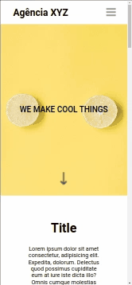

# Landing page com grid e flexbox

#### No desenvolvimento dessa landing page usei conceitos avançados de grid e flexbox. O entendimento e domínio dessas ferramentas são importantes para a criação de telas atrativas e responsivas. De modo geral, trabalhar a responsividade com o grid facilita muito a mantutenção do código.

<br>

## Índice

- [Visão geral](#visão-geral)
- [Captura de tela](#captura-de-tela)
- [Links](#links)
- [Construído com](#construído-com)
- [O que aprendi](#o-que-aprendi)
- [Desenvolvimento contínuo](#desenvolvimento-contínuo)
- [Recursos úteis](#recursos-úteis)
- [Fernando Mendes](#autor)
- [Agradecimentos](#agradecimentos)


## Visão geral

## Captura de tela

<br>

#### Tela Desktop


#### Tela Ipad


#### Tela mobile




## Links

- Site URL: https://landing-page-eta-ten.vercel.app/

## Construído com

<div style="display: inline_block"><br>
  
         
</div>
<br>

## O que aprendi

Nesse projeto aprendi conceitos importantes de grid e flexbox. No CSS, aprendi novos conceitos de animação (como exemplo destaco a seta indicando que tem mais conteúdo na página), estilizar e formatar elementos, e também muito sobre reponsividade. No HTML pude explorar novas possibilidades de estruturação. 

## Trechos de códigos

``` 
CSS

@-webkit-keyframes downarrow {
    0% { -webkit-transform: translateY(0); opacity: .4; }
    100% { -webkit-transform: translateY(.4em); opacity: .9; }
}

@media(max-width: 425px) {
    .hero {
        height: 60vh;
    }

    .hero h2{
        font-weight: 500;
        text-transform: uppercase;
        font-size: 2.5rem;
    }
}

```

## Desenvolvimento contínuo

Pretendo continuar focado em construir um conhecimento sólido nessas limguagens. Ainda há muitos conceitos importantes para serem desenvolvidos. Todos os dias são gradativamente adicionados ao meu repertório de ferramentas.

## Recursos úteis

- [W3School](https://www.w3schools.com/css/default.asp) - Esse site sempre me ajuda a resolver qualquer problema relacionados a códigos de uma maneira fácil e muito rápida.
- [Dev em Dobro](https://www.youtube.com/@DevemDobro) - Este é um canal onde encontro muito material. Tem muito conteúdo relacionado ao desenvolvimento. Recomendo a todos que querem aprender sobre esse e outros conceitos relacionados.

## Autor

[Fernando Mendes](https://www.linkedin.com/in/fernandomendesti/)


## Agradecimentos

Gostaria de agradecer a toda comunidade do DEVQUEST: monitores, alunos e toda a equipe técnica que sempre está de prontidão para ajudar no que for preciso. Deixo aqui um abraço a todos que fazem parte desse projeto. 


